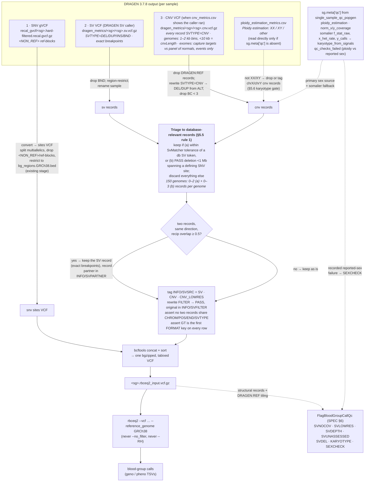

# DRAGEN → RBCeq2: three data sources per sample, and how to combine them

**Date:** 2026-07-16 · **Diagram revised 2026-09-18** to match SPEC §5.5 (triage, one record per event, karyotype gate, QC hand-off) and the first review round (exome path, sex-source fallback, `SVSRC=SV`); the source tables below are unchanged from July apart from the caller name. **Caller naming:** the SV VCF is written by the DRAGEN 3.7.8 SV caller, which integrates and extends Manta; record IDs keep Manta's prefix. This doc says "SV caller", not "Manta".
**Context:** ICA **DRAGEN 3.7.8** (`SW: 13.021.604.3.7.8f`, hg38, `chr`-prefixed) emits
**three** variant files per sample. RBCeq2 (v2.4.x) consumes **one VCF per sample**, and
reads SNVs, indels *and* structural variants out of that single file — there is no
separate CNV/SV input or CLI flag. So the three DRAGEN files must be transformed and
merged into one sorted, bgzipped, tabixed VCF before RBCeq2 runs.

This doc shows each source as it really is (records copied from one of the OurDNA 1KG control replicates), what has
to change, and how the pieces combine. See
[`implement_cnv_rbceq2_research.md`](./implement_cnv_rbceq2_research.md) for the deeper
RBCeq2 source analysis this is built on.

> Grounding: OurDNA carries five **independent sequencings of the same 1000 Genomes
> control sample** — the 1KG replicates — used to check the merged calls are concordant
> across replicates.

---

## The three sources (real layout, `gs://cpg-ourdna-main/ica/dragen_3_7_8/output/`)

| # | Source | Path (per SG `<sg>`) | Caller | RBCeq2-ready? |
|---|--------|----------------------|--------|---------------|
| 1 | **SNV gVCF** | `recal_gvcf/<sg>.hard-filtered.recal.gvcf.gz` | DRAGEN SNV | ✅ needs converting to VCF - already handled |
| 2 | **SV VCF** | `dragen_metrics/<sg>/<sg>.sv.vcf.gz` | DRAGEN SV caller (extends Manta) | ✅ directly compatible |
| 3 | **CNV VCF** | `dragen_metrics/<sg>/<sg>.cnv.vcf.gz` | DRAGEN bin CNV (genomes); DRAGEN panel-of-normals target CNV (exomes) | ⚠️ needs SVTYPE rewrite; absent when the run did not call CNVs |

Sex is read from `sg.meta['qc']`, which `single_sample_qc_popgen` already populates:
`ploidy_estimation`, `norm_x_coverage`, `norm_y_coverage` (DRAGEN's karyotype estimate and X/Y
over autosomal median coverage, from `ploidy_estimation_metrics.csv`), the somalier signals
`f_stat_raw`, `x_het_rate`, `y_calls`, `y_n` (the fallback when DRAGEN omitted the ploidy
file, as it does for genomes with uneven coverage; turned into a karyotype by the atlas repo's
`karyotype_from_signals`), and `qc_checks_failed` (which records the ploidy-versus-reported-sex
check). `dragen_metrics/<sg>/<sg>.ploidy_estimation_metrics.csv` is read directly only when
the meta is absent. **Do not** read sex from the `##referenceSexKaryotype` header: it is a
reference/config constant that reads `XXYY` for *every* sample. Details: SPEC §5.6.

> **Exomes (DRAGEN 3.7.8, checked 2026-09-18):** every exome has the gVCF, the SV VCF and
> both sex-metric files. The 11,917 production exomes also have a CNV VCF, called per capture
> target against a panel of 100 normals: events only, no `DRAGEN:REF:` records, no
> `cnvLength` filter, `BC` in target counts. The 10 exomes of the test run have none (their
> `cnv_metrics.csv` stops after the target-interval count). Whether a CNV VCF is expected is
> read from `cnv_metrics.csv`, not from the sequencing type. SPEC §3, §5.1.

> **Pipeline note:** these paths are shown as raw `gs://…` for grounding. The stage derives
> them from the registered gVCF's DRAGEN output prefix, checks expected presence by
> sequencing type, and records them in the merged VCF's Analysis meta; no new metamist
> analysis types, since `dragen_align` cannot register them before its Nextflow refactor and
> cpg_flow is not to be extended. See SPEC §5.1.

---

## 1. SNV gVCF — convert to a plain sites VCF

Real records:

```text
chr1  9997   .  N  <NON_REF>  .  PASS  END=10017  GT:AD:DP:GQ:MIN_DP:PL:SPL:ICNT  ./.:11,0:11:0:2:...
chr1  10018  .  C  <NON_REF>  .  PASS  END=10018  ...                            0/0:17,0:17:15:17:...
```

**Problem:** it is a **gVCF** — called variant records (which *already carry the
per-sample genotype*, e.g. `0/1`) interleaved with `<NON_REF>` reference blocks (the head
above happens to show only ref blocks). RBCeq2 fetches blood-group sites by coordinate and
expects a plain VCF; the ref blocks and the symbolic `<NON_REF>` allele break it.

**Modification:** convert gVCF → sites VCF — split multiallelics, drop `<NON_REF>` and
reference blocks, restrict to blood-group regions. This is **preprocessing, not
genotyping** — the genotypes are already in the gVCF (GATK `GenotypeGVCFs` does *joint*
genotyping across samples and has no role here). bcftools only; no reference FASTA needed.
- *This is already implemented today* in the `FilterAndConvertGvcfsForRbceq2` stage
  (now `src/popgen_rbceq2/stages/blood_group_genotyping/filter_and_convert.py`) via `bcftools norm -m -any` +
  region-restrict to `resources/bg_regions.GRCh38.bed`. The SNV path is done; the gap is
  sources 2 and 3.

---

## 2. SV VCF (DRAGEN SV caller) — directly compatible ✅

Real records:

```text
chr1  789481  MantaINS:...  G  <INS>  999  PASS  END=789481;SVTYPE=INS;CIPOS=0,7;...
chr1  839442  MantaDEL:...  CACC…ACA  CT  463  PASS  END=839499;SVTYPE=DEL;SVLEN=-57;CIGAR=1M1I57D
chr1  934064  MantaDEL:...  AGGG…    A   412  PASS  END=934904;SVTYPE=DEL;SVLEN=-840;CIPOS=0,27;HOMLEN=27
```

Header ALTs: `<DEL>`, `<INS>`, `<DUP:TANDEM>`. Proper `SVTYPE=DEL/DUP/INS/BND`, plus
`SVLEN`, `END`, `CIPOS/CIEND`, `MATEID`. `DUP:TANDEM` is reported as `<INS>` (a Manta
convention the DRAGEN caller keeps) — fine, it matches the DB's INS/dup tokens. FORMAT is
`GT:FT:GQ:PL:PR:SR` (or without `SR`) on every record.

**Modification:** essentially none for matching. Only housekeeping — drop `BND`, restrict to
blood-group regions (size optimisation; RBCeq2 also does this internally), ensure the
sample column name matches the merged VCF, sort/bgzip/tabix. **This is exactly what
RBCeq2's `SvReader` was built for.**

---

## 3. CNV VCF — needs SVTYPE rewrite ⚠️

Real records:

```text
chr1  817861    DRAGEN:REF:chr1:817861-2650427   N  .      81  PASS       END=2650427;REFLEN=1832567                        ./.:0.98:2:1434:...
chr1  2650427   DRAGEN:LOSS:chr1:2650428-2653075 N  <DEL>  51  cnvLength  SVLEN=-2648;SVTYPE=CNV;END=2653075;REFLEN=2648    1/1:0.058:0:2:...
chr1  3501568   DRAGEN:GAIN:chr1:3501569-3502568 N  <DUP>  88  cnvLength  SVLEN=1000;SVTYPE=CNV;END=3502568;REFLEN=1000     ./1:3.18:6:1:...
```

Header ALTs `<CNV>`/`<DEL>`/`<DUP>`; FORMAT is `GT:SM:CN:BC:PE` on every record, with `CN`
the estimated copy number and `BC` the bin count. Every PASS `<DUP>` in 150 genomes carried
GT `./1`; every PASS `<DEL>` carried `0/1` or `1/1`.

**Three problems, three fixes:**

1. **Every record is `SVTYPE=CNV`.** Direction lives only in the `<DEL>`/`<DUP>` ALT and
   the `CN`/`SM` values. RBCeq2's `SvMatcher.compatible()` requires *DB-token type ==
   event `SVTYPE`*, and the DB has `DEL`/`DUP` tokens — so `"DEL" == "CNV"` → **False →
   large gene deletions never match.** The `<DEL>`/`<DUP>` ALT fallback in `SvReader`
   fires *only when `SVTYPE` is absent* (`large_variants.py:739`), which it isn't here,
   and `DragenEncoder` does **not** rescue this (it only builds the display string).
   - **Fix:** rewrite `SVTYPE=CNV` → `DEL`/`DUP`, taken from the `<DEL>`/`<DUP>` ALT
     (or `CN < expected` → DEL, `CN > expected` → DUP, using per-sample ploidy on sex
     chromosomes). Alternatively strip the `SVTYPE` INFO field so `SvReader` reads the
     ALT symbol — but explicit rewrite is clearer.
2. **`DRAGEN:REF:` records** (ALT `.`, no `SVTYPE`) are non-events. Drop them (RBCeq2
   would skip them anyway).
3. **`cnvLength` filter** flags CNVs < 10 kb (the majority of records). RBCeq2 keeps only
   `FILTER=PASS` unless `--no_filter`. Decide policy: either source 2–50 kb events from
   the **SV VCF** (source 2), or run RBCeq2 with `--no_filter` and keep the small CNVs.

---

## How they combine



> **Exomes** take the same path. With a production CNV VCF, the §5.4 step has no REF records to
> drop and the QC reads "was the region assessed" from the capture design rather than from
> `DRAGEN:REF:` tiling (SPEC §6). Where a run produced no CNV VCF (the test run), source 3 is
> absent, triage runs over the SV records alone, and every 10 kb+ target is `SVUNASSESSED`.

> **Why one record per event.** rbceq2 keeps the best db token per *record*, so a deletion that
> arrives from both callers, offset by the CNV caller's bin snapping, is read as two different
> alleles (a compound heterozygote). Its 2.4.4 tie error needs identical coordinates and never
> fires on real pairs. Figure and evidence: SPEC §5.5 and `sv_cnv_overlap_50_samples.md`.

### Combine step notes
- **Merge = `bcftools concat` of the three normalised VCFs, then sort/bgzip/tabix.** All
  three must share the same sample column name and contig naming (`chr`-prefixed hg38);
  RBCeq2 strips the `chr` prefix internally.
- **FORMAT fields (review asked, 2026-09-18):** nothing to harmonise. FORMAT is per record,
  so gVCF rows keep `GT:AD:DP:GQ:…`, SV rows `GT:FT:GQ:PL:PR:SR`, CNV rows `GT:SM:CN:BC:PE`.
  RBCeq2 only requires `GT` first on every retained row (`IO/vcf.py`), true of all three,
  and reads the SV geometry from INFO. `bcftools concat` writes the union of the headers;
  the tags the SV and CNV headers share (`GT`, `END`, `SVTYPE`, `SVLEN`, `CIPOS`, `CIEND`)
  have identical Number/Type in DRAGEN 3.7.8, and a real concat of one genome's SV and CNV
  files produced no header warning. SPEC §5.5.
- **SV ∩ CNV overlap:** decided, SPEC §5.5 rule 3. Dedup at merge time, keeping the SV
  record and recording the CNV partner; `select_best_per_vcf` cannot do it because it keeps
  one db token per record, not per locus.
- **Adjacent records (review asked):** not merged. Across 150 genomes, adjacent
  same-direction CNV records were copy-number steps (3 of 254 pairs shared a `CN`), never a
  target split in two, and the SV caller produced one such pair in 17,175 records.
  `sv_cnv_overlap_50_samples.md` §13.
- **Sex chromosomes:** for X-linked systems (XK/Kx, XG, CD99) the expected copy number
  depends on the sample's sex karyotype. Resolve sex from the QC meta in metamist (DRAGEN
  ploidy estimate, somalier signals as fallback, recorded reported-sex check; SPEC §5.6), and
  feed expected ploidy into the CNV direction logic — don't assume diploid on chrX/chrY.

### Caveats carried from the research
- **RH / GYP hybrids are unreliable on short-read DRAGEN** (RHD/RHCE and GYPA/B/E are
  near-identical paralogs → MAPQ0, noisy/absent SV & CNV calls). `--RH` is documented
  **long-read only**. Straightforward large deletions and small indels are in reach;
  treat hybrid alleles as out of scope for this pipeline.
- Phasing is opt-in (`--phased`, default off) and never required for detection — leave
  it off.
