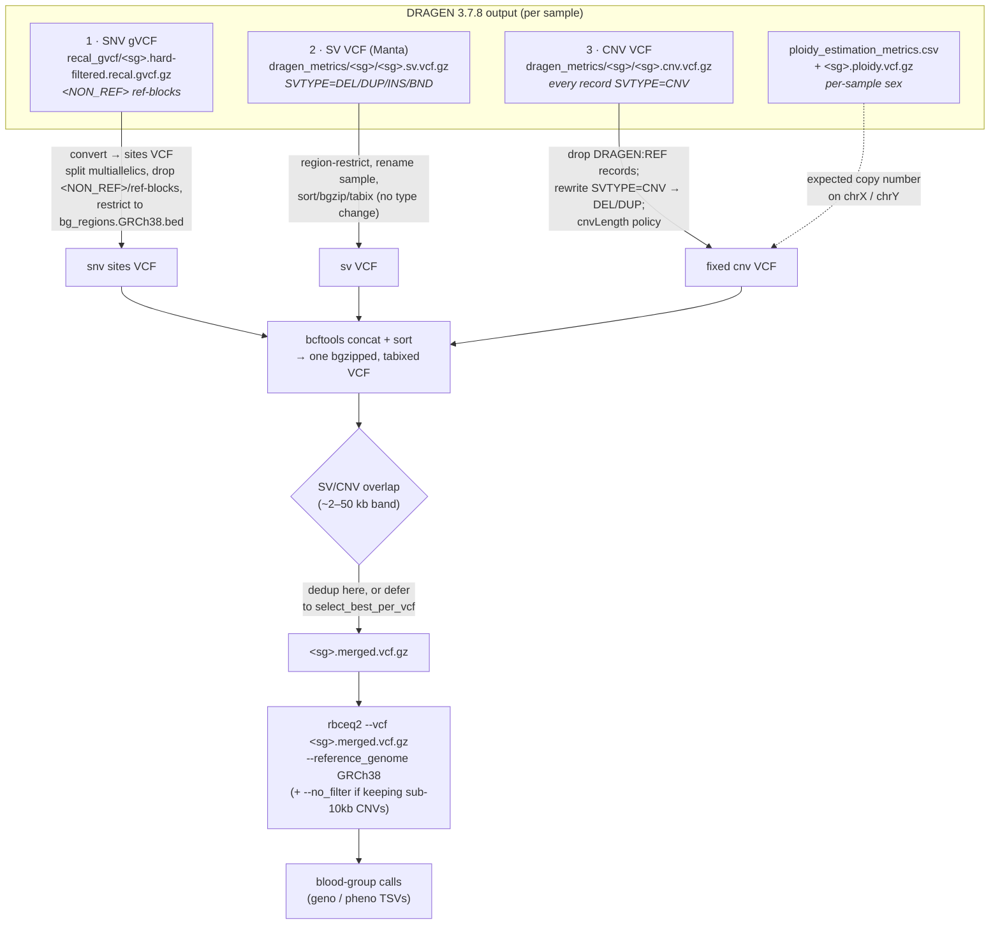

# DRAGEN → RBCeq2: three data sources per sample, and how to combine them

**Date:** 2026-07-16
**Context:** ICA **DRAGEN 3.7.8** (`SW: 13.021.604.3.7.8f`, hg38, `chr`-prefixed) emits
**three** variant files per sample. RBCeq2 (v2.4.x) consumes **one VCF per sample**, and
reads SNVs, indels *and* structural variants out of that single file — there is no
separate CNV/SV input or CLI flag. So the three DRAGEN files must be transformed and
merged into one sorted, bgzipped, tabixed VCF before RBCeq2 runs.

This doc shows each source as it really is (records copied from one of the OurDNA 1KG control replicates), what has
to change, and how the pieces combine. See
[`implement_cnv_rbceq2_research.md`](./implement_cnv_rbceq2_research.md) for the deeper
RBCeq2 source analysis this is built on.

> Grounding: OurDNA carries five **independent sequencings of the same 1000 Genomes
> control sample** — the 1KG replicates — used to check the merged calls are concordant
> across replicates.

---

## The three sources (real layout, `gs://cpg-ourdna-main/ica/dragen_3_7_8/output/`)

| # | Source | Path (per SG `<sg>`) | Caller | RBCeq2-ready? |
|---|--------|----------------------|--------|---------------|
| 1 | **SNV gVCF** | `recal_gvcf/<sg>.hard-filtered.recal.gvcf.gz` | DRAGEN SNV | ✅ needs converting to VCF - already handled |
| 2 | **SV VCF** | `dragen_metrics/<sg>/<sg>.sv.vcf.gz` | Manta-derived | ✅ directly compatible |
| 3 | **CNV VCF** | `dragen_metrics/<sg>/<sg>.cnv.vcf.gz` | DRAGEN bin CNV | ⚠️ needs SVTYPE rewrite |

Supporting file (not merged, read for sex): `dragen_metrics/<sg>/<sg>.ploidy_estimation_metrics.csv`
and `<sg>.ploidy.vcf.gz` — X/Y coverage ratios for per-sample sex. **Do not** read sex
from the `##referenceSexKaryotype` header: it is a reference/config constant that reads
`XXYY` for *every* sample.

> **Pipeline note:** these paths are shown as raw `gs://…` for grounding, but the SV and CNV
> VCFs must be **registered in metamist** (a dedicated analysis type each) before a stage can
> resolve them — ideally upstream in the `dragen_align` pipeline that produces them. See SPEC
> §4 / §5.1.

---

## 1. SNV gVCF — convert to a plain sites VCF

Real records:

```text
chr1  9997   .  N  <NON_REF>  .  PASS  END=10017  GT:AD:DP:GQ:MIN_DP:PL:SPL:ICNT  ./.:11,0:11:0:2:...
chr1  10018  .  C  <NON_REF>  .  PASS  END=10018  ...                            0/0:17,0:17:15:17:...
```

**Problem:** it is a **gVCF** — called variant records (which *already carry the
per-sample genotype*, e.g. `0/1`) interleaved with `<NON_REF>` reference blocks (the head
above happens to show only ref blocks). RBCeq2 fetches blood-group sites by coordinate and
expects a plain VCF; the ref blocks and the symbolic `<NON_REF>` allele break it.

**Modification:** convert gVCF → sites VCF — split multiallelics, drop `<NON_REF>` and
reference blocks, restrict to blood-group regions. This is **preprocessing, not
genotyping** — the genotypes are already in the gVCF (GATK `GenotypeGVCFs` does *joint*
genotyping across samples and has no role here). bcftools only; no reference FASTA needed.
- *This is already implemented today* in the `FilterAndConvertGvcfsForRbceq2` stage
  (`src/ourdna_genomic_atlas/stages.py:410`) via `bcftools norm -m -any` +
  region-restrict to `resources/bg_regions.GRCh38.bed`. The SNV path is done; the gap is
  sources 2 and 3.

---

## 2. SV VCF (Manta) — directly compatible ✅

Real records:

```text
chr1  789481  MantaINS:...  G  <INS>  999  PASS  END=789481;SVTYPE=INS;CIPOS=0,7;...
chr1  839442  MantaDEL:...  CACC…ACA  CT  463  PASS  END=839499;SVTYPE=DEL;SVLEN=-57;CIGAR=1M1I57D
chr1  934064  MantaDEL:...  AGGG…    A   412  PASS  END=934904;SVTYPE=DEL;SVLEN=-840;CIPOS=0,27;HOMLEN=27
```

Header ALTs: `<DEL>`, `<INS>`, `<DUP:TANDEM>`. Proper `SVTYPE=DEL/DUP/INS/BND`, plus
`SVLEN`, `END`, `CIPOS/CIEND`, `MATEID`. `DUP:TANDEM` is reported as `<INS>` (Manta
convention) — fine, it matches the DB's INS/dup tokens.

**Modification:** essentially none for matching. Only housekeeping — restrict to
blood-group regions (size optimisation; RBCeq2 also does this internally), ensure the
sample column name matches the merged VCF, sort/bgzip/tabix. **This is exactly what
RBCeq2's `SvReader` was built for.**

---

## 3. CNV VCF — needs SVTYPE rewrite ⚠️

Real records:

```text
chr1  817861    DRAGEN:REF:chr1:817861-2650427   N  .      81  PASS       END=2650427;REFLEN=1832567                        ./.:0.98:2:1434:...
chr1  2650427   DRAGEN:LOSS:chr1:2650428-2653075 N  <DEL>  51  cnvLength  SVLEN=-2648;SVTYPE=CNV;END=2653075;REFLEN=2648    1/1:0.058:0:2:...
chr1  3501568   DRAGEN:GAIN:chr1:3501569-3502568 N  <DUP>  88  cnvLength  SVLEN=1000;SVTYPE=CNV;END=3502568;REFLEN=1000     ./1:3.18:6:1:...
```

Header ALTs `<CNV>`/`<DEL>`/`<DUP>`; `FORMAT` has `CN` (estimated copy number).

**Three problems, three fixes:**

1. **Every record is `SVTYPE=CNV`.** Direction lives only in the `<DEL>`/`<DUP>` ALT and
   the `CN`/`SM` values. RBCeq2's `SvMatcher.compatible()` requires *DB-token type ==
   event `SVTYPE`*, and the DB has `DEL`/`DUP` tokens — so `"DEL" == "CNV"` → **False →
   large gene deletions never match.** The `<DEL>`/`<DUP>` ALT fallback in `SvReader`
   fires *only when `SVTYPE` is absent* (`large_variants.py:739`), which it isn't here,
   and `DragenEncoder` does **not** rescue this (it only builds the display string).
   - **Fix:** rewrite `SVTYPE=CNV` → `DEL`/`DUP`, taken from the `<DEL>`/`<DUP>` ALT
     (or `CN < expected` → DEL, `CN > expected` → DUP, using per-sample ploidy on sex
     chromosomes). Alternatively strip the `SVTYPE` INFO field so `SvReader` reads the
     ALT symbol — but explicit rewrite is clearer.
2. **`DRAGEN:REF:` records** (ALT `.`, no `SVTYPE`) are non-events. Drop them (RBCeq2
   would skip them anyway).
3. **`cnvLength` filter** flags CNVs < 10 kb (the majority of records). RBCeq2 keeps only
   `FILTER=PASS` unless `--no_filter`. Decide policy: either source 2–50 kb events from
   the **SV VCF** (source 2), or run RBCeq2 with `--no_filter` and keep the small CNVs.

---

## How they combine



### Combine step notes
- **Merge = `bcftools concat` of the three normalised VCFs, then sort/bgzip/tabix.** All
  three must share the same sample column name and contig naming (`chr`-prefixed hg38);
  RBCeq2 strips the `chr` prefix internally.
- **SV ∩ CNV overlap:** the SV and CNV callers both emit events in the ~2–50 kb band, so
  the same deletion can appear twice. Either dedup at merge time, or leave both and let
  RBCeq2's `select_best_per_vcf` (tie-break) pick — decision still open.
- **Sex chromosomes:** for X-linked systems (XK/Kx, XG, CD99) the expected copy number
  depends on the sample's sex karyotype. Resolve sex from the ploidy files (not the
  header) and feed expected ploidy into the CNV direction logic — don't assume diploid
  on chrX/chrY.

### Caveats carried from the research
- **RH / GYP hybrids are unreliable on short-read DRAGEN** (RHD/RHCE and GYPA/B/E are
  near-identical paralogs → MAPQ0, noisy/absent SV & CNV calls). `--RH` is documented
  **long-read only**. Straightforward large deletions and small indels are in reach;
  treat hybrid alleles as out of scope for this pipeline.
- Phasing is opt-in (`--phased`, default off) and never required for detection — leave
  it off.
